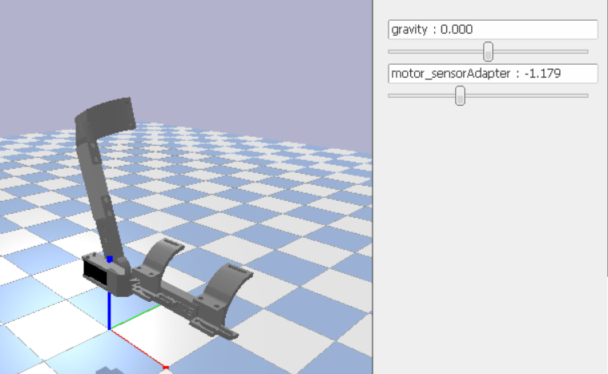

# exoedu-robot

## simulation

1. Build urdf model using stl files and load in the pybullet simulation.
    ```
    export MESA_GL_VERSION_OVERRIDE=3.3 
    python test_robot.py
    ```
    

## connect through ROS 

1. launch aduino - [tutorial](http://wiki.ros.org/rosserial_arduino/Tutorials).
    Use arduino IDE to upload the [code](./arduino/ros_test.ino) to the arduino/ Once the compilation is completed, you will receive a message about program storage space and dynamic memory usage, similar to this:
    ```
    Sketch uses 9,392 bytes (29%) of program storage space. Maximum is 32,256 bytes. Global variables use 1,356 bytes (66%) of dynamic memory, leaving 692 bytes for local variables. Maximum is 2,048 byte
    ```

2. launch launch roscore and roserial to create publish and subscriber
    ```
    roscore
    rosrun rosserial_arduino serial_node.py /dev/ttyACM0 _baud:=57600
    export MESA_GL_VERSION_OVERRIDE=3.3 
    python main.py
    ```
     

## connect through Webots

1. launch webots with web interface. Run the [bash](./webots_worlds/install_webot.sh) to install webots thourgh binary release or deb - [tutorial](https://cyberbotics.com/doc/guide/installation-procedure?tab-language=python#installing-the-tarball-package).
    ```
    export WEBOTS_HOME=/home/username/webots
    export MESA_GL_VERSION_OVERRIDE=3.3 
    webots /root/exoedu-robot/webot_worlds/worlds/exoedu_blank.wbt   --no-sandbox  --stream
    ```
    In the ***webot_worlds/web*** folder, run following command to launch the web server
    ```
    python3 -m http.server
    ```
    Remember to open the simulation server port 1234 and then access the client GUI by the address: localhost_ip:8000

